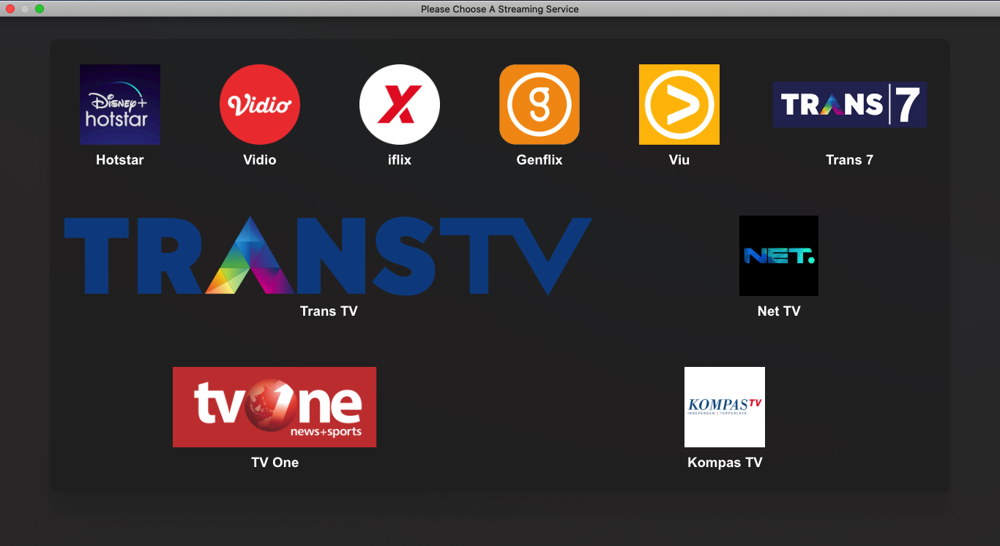

## PlayFlix

An Electron Based Web Video Services Player. Supporting Disney+ Hotstar, Vidio, iflix, Genflix, Viu, And More.



_The apps main menu interface_

# Features

- Multiple Streaming Services Support (JSON Configuration to add extra)
- Adblock
- Always On Top Window
- Set Startup Page (Any Service or Remember Last Opended Page)
- Frameless Window
- Rough Mac Picture in Picture Support (Floating Window, Above All Desktop and Fullscreen Applications)
- Full Screen Window on Startup

# Analytics

This application has analytics built in which is used to help the developers make a better product. [Simple Analytics](https://simpleanalytics.com) was chosen due to their strong views on keeping users private. They are also GDPR, CCPA, & PECR compliant.

# Developing

Sorry in advance that build system currently to get the app working is a mess and requires multiple package.json's this will hopefully be fixed in the future. Please contact me if you need help.

```bash
git clone https://github.com/tommy-maulana/playflix/
cd playflix/

# For Linux
ln -s package.linux.json package.json
# For Mac
ln -s package.mac.json package.json

npm install
npm start
```

# TODO

- Add Tests - once Electron versions are the same between Mac and Linux
- Add Windows Support
- Add Dependency Updates Alerter Bot

## Should fix at some point

- Menubar Transparency Glitch On Mac
